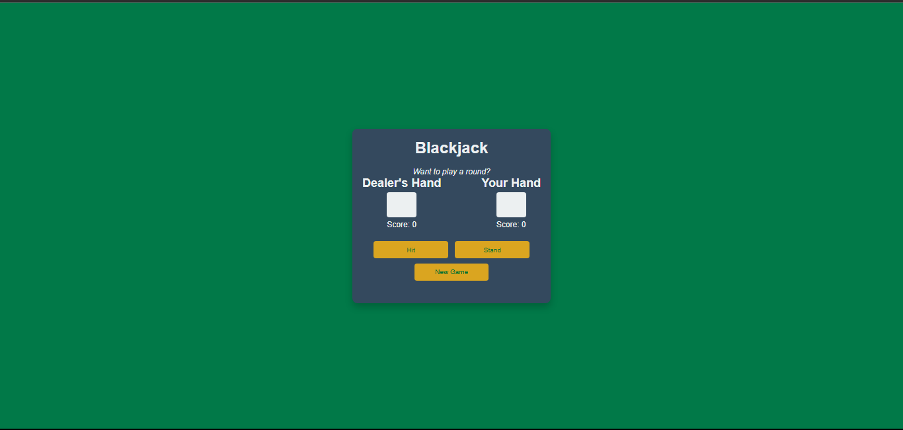

# Blackjack Game

This is a simple browser-based Blackjack game built with HTML, CSS, and JavaScript. The game allows players to draw cards, stand, and try to beat the dealer in a classic game of Blackjack.

## Features

- **Start New Game**: Begin a new game by clicking the "New Game" button.
- **Hit**: Draw a new card and add it to the player's hand.
- **Stand**: End the player's turn and trigger the dealer's turn.
- **Game Outcome**: The game will announce whether the player won, lost, or if it's a tie.

## Demo

[Live Demo](https://scrimba-horatio-blackjack.netlify.app)

## Screenshot



## How to Play

1. **Start Game**: Click on the "New Game" button to start a new game.
2. **Hit**: Draw a new card by clicking the "Hit" button.
3. **Stand**: When you feel confident with your hand, click the "Stand" button to end your turn.
4. The dealer will automatically play their turn, drawing cards until their total is at least 17.
5. The game will display the winner (Player or Dealer) based on who has the highest hand, or it will declare a tie.
6. If you bust (go over 21), you lose the game.

## Installation

To play the game locally:

1. Clone the repository:
   ```bash
   git clone https://github.com/horatioDev/scrimba-blackjack-game.git
